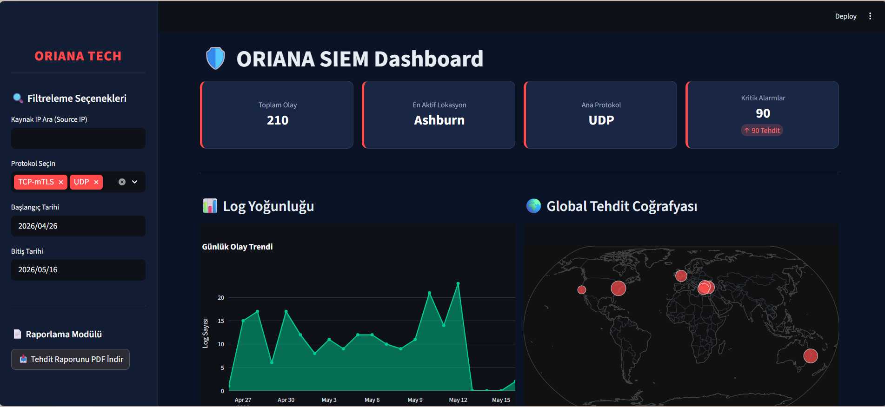
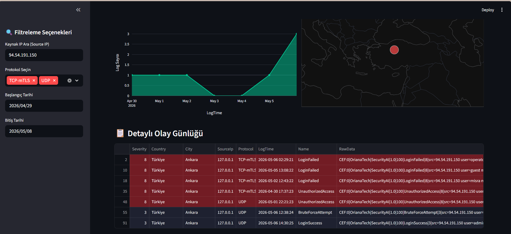
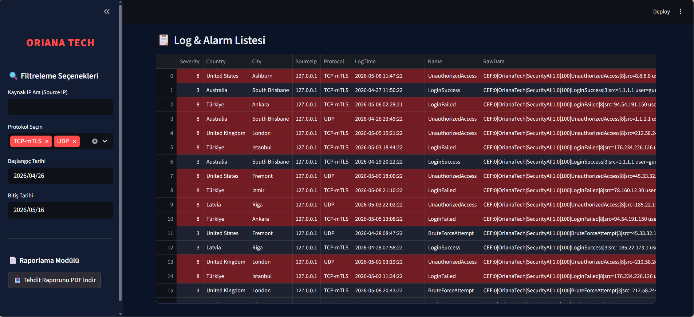

# 🛡️ Oriana SIEM - UDP/TCP Log Toplama ve Korelasyon Uygulaması

<div align="center">


**Heterojen ağlardan gelen siber güvenlik verilerini toplayan, anlamlandıran ve proaktif olarak raporlayan modern NoSQL tabanlı SIEM çözümü**

[Genel Bakış](#-genel-bakış) • [Proje Gelişim Aşamaları](#-proje-gelişim-aşamaları-ve-mimari) • [Teknik Spektrum](#-teknik-spektrum) • [Kurulum ve Sistem Gereksinimleri](#️-kurulum-ve-sistem-gereksinimleri) • [Proje Kaynak Kod Mimarisi](#-proje-kaynak-kod-mimarisi) • [Gelişmiş Özellikler](#-gelişmiş-özellikler-ve-mantıksal-kurallar)

</div>

---

## 🎯 Genel Bakış

Bu çalışma, **Oriana Tech** bünyesinde gerçekleştirilen İşyeri Eğitimi kapsamında geliştirilmiştir. Çözüm; ağ üzerindeki dağınık log verilerini merkezi bir mimaride toplayarak normalize etmek, güvenlik şiddetine göre korele etmek ve SOC (Güvenlik Operasyon Merkezi) ekiplerinin anlık müdahale edebileceği interaktif bir dashboard sunmak amacıyla tasarlanmıştır.

---

## 📱 Ekran Görüntüleri

<div align="center">

### Ana Sayfa (SOC İzleme Paneli)


### Küresel Tehdit Haritası ve Bölgesel Analiz Modu


### Canlı Log ve Alarm Listesi (Kritik Seviye Renklendirmesi)


</div>

---

## 🚀 Proje Gelişim Aşamaları ve Mimari

Sistem, ham log verisinin siber güvenlik istihbaratına dönüşme sürecini 5 ana aşamada asenkron olarak yürütür:

1. **Ingestion (Veri Toplama):** Ağ trafiğini simüle eden C# .NET tabanlı `TestSender` yazılımı ile besleme yapılır.
2. Testler üç senaryoda doğrulanmıştır:
   * **Manuel Tekil Gönderim (UDP):** Standart log iletim doğrulaması.
   * **Güvenli Tekil Gönderim (TCP-mTLS):** Çift taraflı sertifika doğrulama (mTLS) mekanizması.
   * **Hibrit Toplu Simülasyon:** Yük altında veri kaybını test etmek amacıyla 100+ paket karma dağıtılarak dinlenir.
3. **Parsing & Normalization:** Karmaşık metin yığınları Regex ve key-value eşleşmeleriyle yapılandırılmış nesnelere dönüştürülür.
4. **Persistence (Veri Saklama):** Yapılandırılmış veriler ve ham loglar NoSQL mimaride (**MongoDB**) arşivlenir.
5. **Correlation & Analysis:** CEF formatındaki `Severity` alanı 0-10 skalasında değerlendirilir:
   * 🔵 **Düşük (0-3):** Genel sistem bilgilendirmeleri ve başarılı kullanıcı girişleri.
   * 🟠 **Orta (4-7):** Şüpheli aktiviteler, ardışık başarısız giriş denemeleri (İnceleme Gerektirir).
   * 🔴 **Yüksek/Kritik (8-10):** Doğrudan tehditler (Malware, Unauthorized Access). Dashboard'da kırmızı renkle önceliklendirilir.
6. **Visualization & Reporting:** Verileri anlamlı siber istihbarata dönüştüren **Streamlit** tabanlı görselleştirme katmanıdır.

---

## 📚 Teknik Spektrum

### Teknoloji Stack

| Katman | Teknoloji | Fonksiyon |
| :--- | :--- | :--- |
| **Backend** | Python 3.10 | Core logic, veri fallback mekanizmaları, otonom raporlama motoru. |
| **mTLS Güvenliği** | SSL/TLS | TCP iletişiminde çift taraflı dijital sertifika doğrulaması. |
| **Veritabanı** | MongoDB | Ham ve parse edilmiş logların NoSQL mimaride saklanması. |
| **Dashboard** | Streamlit | Gerçek zamanlı izleme, dinamik filtreleme ve SOC arayüzü. |
| **Simülasyon / Collector** | C# .NET | Saldırı senaryosu üreten `TestSender` ve asenkron socket collector (`SIEM.Scanner`). |
| **Görselleştirme** | Plotly & Pandas | Zaman serisi analizleri ve küresel tehdit haritası (Bubble Chart). |

---

## 🛠️ Kurulum ve Sistem Gereksinimleri

### Ön Gereksinimler
* **MongoDB:** `localhost:27017` portu üzerinde yerel bir servis aktif olmalıdır.
* **Python (v3.10+):** Dashboard ve PDF modülü için gereklidir.
* **.NET SDK (v8.0):** C# projelerinin (`Scanner` ve `TestSender`) derlenmesi için kurulmalıdır.

### 1️⃣ Bağımlılıkların Yüklenmesi (Python)
Terminali projenin kök dizininde açarak gerekli kütüphaneleri yükleyin:
```bash
pip install streamlit pymongo pandas plotly fpdf
```

### 2️⃣ Dijital Sertifikaların Yerleşimi (mTLS)
OpenSSL ile üretilen sertifika paketlerini ilgili derleme (output) klasörlerine yerleştirin:
* `server.pfx` (Şifre: 1234) ➡️ `SIEM.Scanner` output dizinine.
* `client.pfx` (Şifre: 1234) ➡️ `SIEM.TestSender` output dizinine.

### 3️⃣ Soket Dinleyicinin Başlatılması (C#)
UDP ve TCP-mTLS log akışlarını kabul edecek ana motoru ayağa kaldırın:
```bash
cd SIEM.Scanner
dotnet run
```
*Konsolda "Sistem UDP ve TCP (mTLS) 514 üzerinden dinlemede." uyarısı görüldüğünde sistem hazırdır.*

### 4️⃣ SOC Dashboard Arayüzünün Çalıştırılması
Veritabanındaki logları anlık analiz etmek ve haritalandırmak için Streamlit'i tetikleyin:
```bash
streamlit run app.py
```
*Sistem otonom olarak varsayılan tarayıcıda http://localhost:8501 adresini başlatacaktır.*

### 5️⃣ Log Akışının Tetiklenmesi (Simülasyon)
Sisteme test verisi basmak ve korelasyon kurallarını tetiklemek için simülasyon yazılımını başlatın:
```bash
cd SIEM.TestSender
dotnet run
```
*Ekrana gelen menüden Manuel UDP, Manuel TCP-mTLS veya Hibrit Simülasyon modlarından birini seçerek sisteme log basın.*

---

## 📚 Proje Kaynak Kod Mimarisi

### 1️⃣ Çekirdek Arayüz ve Veri İşleme Motoru (`app.py`)
MongoDB bağlantısını yönetir, Pandas ve Plotly kullanarak dinamik filtreleme ve grafik yapılarını oluşturur.

* **Unicode Karakter Normalizasyonu:** Codec hatalarını önlemek için Türkçe karakterleri evrensel ASCII karşılıklarına dönüştürür.
```python
def tr_to_en (text):
    mapping = {'İ': 'I', 'ı': 'i', 'Ş': 'S', 'ş': 's', 'Ğ': 'G', 'ğ': 'g', 'Ç': 'C', 'ç': 'c', 'Ö': 'O', 'ö': 'o', 'Ü': 'U', 'ü': 'u'}
    for tr, en in mapping.items():
        text = str(text).replace(tr, en)
    return text
```

* **Zaman Fallback Mekanizması:** Eksik veya hatalı zaman damgalarını hiyerarşik kontrol (msgTime ➡️ LogTime ➡️ Timestamp) ile senkronize ederek veri kaybını önler.
```python
if 'msgTime' in df.columns and 'LogTime' in df.columns:
    df['LogTime'] = df['msgTime'].fillna(df['LogTime'])
elif 'msgTime' in df.columns:
    df['LogTime'] = df['msgTime']
df['LogTime'] = pd.to_datetime(df['LogTime'], errors='coerce')
df['LogTime'] = df['LogTime'].fillna(pd.Timestamp.now())
```

### 2️⃣ Çift Taraflı Sertifika Doğrulamalı Dinleyici (`SIEM.Scanner / Program.cs`)
Asenkron mimaride çalışarak `clientCertificateRequired: true` parametresiyle mTLS el sıkışmasını (Handshake) zorunlu kılar.
```csharp
// TLS 1.2 üzerinden istemci sertifikası zorunlu kılınarak güvenli handshake başlatılır
await sslStream.AuthenticateAsServerAsync(cert, clientCertificateRequired: true, enabledSslProtocols: SslProtocols.Tls12, checkCertificateRevocation: false);
```

### 3️⃣ Ayrıştırıcı Motoru (`SIEM.Core / Helpers / CefParser.cs`)
Compiled Regex kullanarak standart dışı CEF metin yığınlarındaki 7 ana zorunlu alanı performanslı bir şekilde yakalar, genel sistem bilgilendirmelerini ve veritabanı için sanitize eder.
```csharp
private static readonly Regex CefHeaderRegex = new Regex(@"^CEF:(?<version>\d+)\|(?<vendor>[^|]+)\|(?<product>[^|]+)\|(?<devVersion>[^|]+)\|(?<eventId>[^|]+)\|(?<name>[^|]+)\|(?<severity>[^|]+)\\", RegexOptions.Compiled);
```

---

## 🔒 Gelişmiş Özellikler ve Mantıksal Kurallar

* **Sıfır Veri Kaybı (Zero-Loss) Prensibi:** Zaman damgası veya şeması bozuk loglar sistem dışına atılmak yerine akıllı fallback mekanizması ile kurtarılarak analiz süreçlerine dahil edilir.
* **Dinamik Coğrafi Normalizasyon (Analiz Modu):** Türkiye kaynaklı saldırılar tespit edildiğinde, bölgesel tehdit yoğunluğunu doğru kümelemek adına veriler 3 ana siber metropole (İstanbul, Ankara, İzmir) yönlendirilir ve haritada Bubble Chart büyüklükleriyle yansıtılır.
* **Severity Tabanlı Korelasyon:** Kritik siber olaylar (Severity 8-10) siber güvenlik standartlarına uygun olarak koyu kırmızı tonlarında boyanarak operasyonel gürültü filtrelenir  ve MTTR (Müdahale Süresi) kısaltılır.
* **Uçtan Uca Şifreli mTLS Hattı:** Araya girme (MitM) saldırılarını engellemek amacıyla sertifikasız hiçbir cihazın sisteme log basmasına izin verilmez.

---

## 📋 Proje İstatistikleri
* 📝 **15 Günlük** Gerçekçi ve tekli hibrit saldırı senaryosu simülasyonu.
* ⏱️ **<500ms** API ve anlık log işleme asenkron hızı.
* 📊 **0 Veri Kaybı** Akıllı Fallback mekanizması doğrulaması.
* 🛡️ **Uçtan Uca mTLS** TLS 1.2 protokolü tabanlı kimlik doğrulama şifrelemesi.

---

## 📂 Kapsamlı Dokümantasyon

Geliştirme detayları, prodüksiyon senaryoları ve işyeri eğitimi özet sunumlarına aşağıdaki ek dokümanlardan ulaşabilirsiniz:
* [📘 Üretim Ortamı ve Kullanım Rehberi](PRODUCTION_READY_GUIDE.md)
* [🚀 Uçtan Uca Dağıtım ve Kurulum Rehberi](ULTIMATE_DEPLOYMENT_GUIDE.md)
* [📊 Proje ve İşyeri Eğitimi Özeti](FINAL_PROJECT_SUMMARY.md)

---

## 📞 İletişim & Geliştirici Bilgileri

* **Geliştirici:** Mısra Kara 
* **Kurum:** Karabük Üniversitesi - Bilgisayar Mühendisliği
* **Staj Dönemi / Firma:** İşyeri Eğitimi (2026) - Ozztech Bilgi Güvenliği / Oriana Tech 

---

<div align="center">

Made with ❤️ by Mısra Kara


</div>
